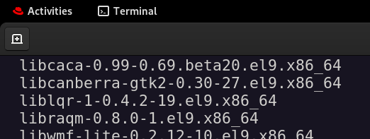
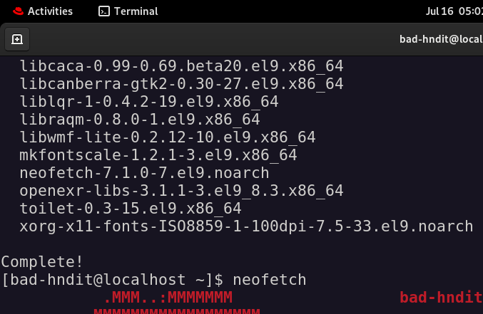
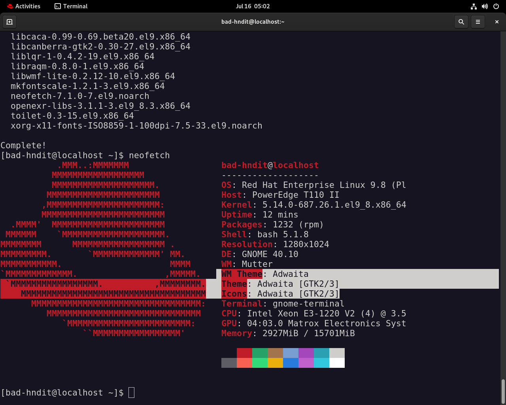
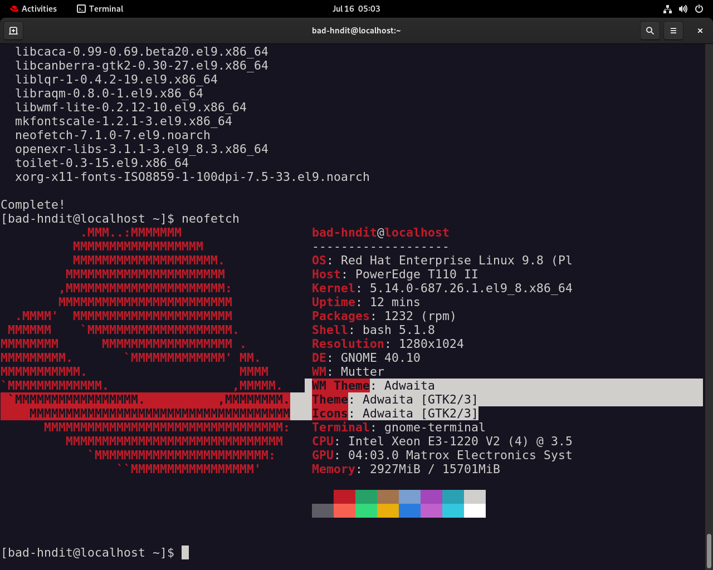
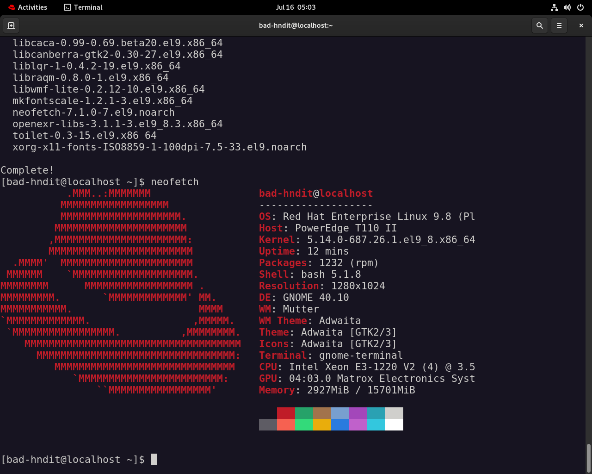
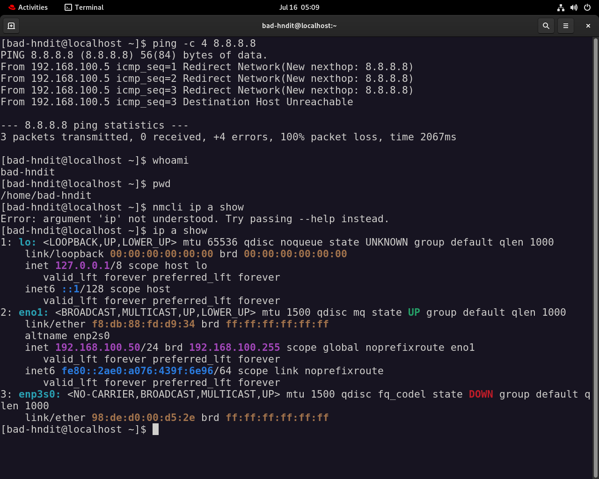

#  Lab 02: RHEL Server Setup and Preliminary Hardening

# Date: 16 July 2026

This lab walks through the initial setup of a Red Hat Enterprise Linux (RHEL) server, focusing on subscription management, repository configuration, and essential tooling installation. These steps establish a foundation for subsequent security hardening tasks.

---

##  Phase 1: Red Hat Subscription Management

On initial deployment, the system is unregistered against Red Hat's subscription services, blocking access to package repositories.

> **⚠️ Warning:** An unregistered system will surface errors such as `Unable to read consumer identity` and `There are no enabled repositories`. These typically stem from either a missing registration or organizational account profile restrictions preventing auto-attach from resolving the correct subscription pool.

To resolve this, clear any stale subscription data, register the system, and attach an available subscription.

```bash
# Clear any existing (possibly corrupted) subscription data
sudo subscription-manager clean

# Register the system and auto-attach an available subscription
sudo subscription-manager register --username <username> --auto-attach

# Verify subscription status is current
sudo subscription-manager status
```

> **Note:** If `--auto-attach` fails to find a valid pool, confirm the account used has an active RHEL entitlement and is not restricted by an organizational profile that limits subscription visibility.





---

##  Phase 2: Enabling Extra Repositories (EPEL)

To extend the available package list beyond the standard base OS offerings, the Extra Packages for Enterprise Linux (EPEL) repository is configured.

```bash
# Install the EPEL release package
sudo dnf install https://dl.fedoraproject.org/pub/epel/epel-release-latest-9.noarch.rpm -y

# Clean cached repository metadata
sudo dnf clean all

# Refresh metadata and apply any pending upgrades
sudo dnf upgrade --refresh
```




---

##  Phase 3: Installing System Information Utilities

Visual CLI system layout utilities are installed for quick, at-a-glance tracking of hardware utilization, kernel versions, and shell states during ongoing maintenance.

```bash
# Classic system info display tool
sudo dnf install neofetch -y

# Modern, faster alternative to neofetch
sudo dnf install fastfetch -y
```



---

##  Hardware Profile & Drivers Notes

The server is built around an Intel Xeon E3-1220 V2, a Sandy Bridge-generation server CPU that does not include integrated graphics (no on-die GPU). As a result, display output is handled entirely outside the Intel CPU package:

- The system operates primarily in a headless configuration, accessed via SSH for day-to-day administration.
- When local console output is required, video is provided by the native onboard motherboard VGA controller (commonly an ASPEED or Matrox server-grade chipset used for baseboard management / IPMI-style consoles), not a discrete or Intel-integrated GPU.
- Because there is no Intel integrated graphics hardware present, no proprietary Intel display drivers are required or applicable to this system.
- Any future GPU-dependent workloads (e.g., hardware transcoding) would require a discrete add-in card, as the current platform has no onboard graphics acceleration path.

---

##  Future Roadmap

- [ ] Set up Docker / Podman for containerized services
- [ ] Configure a reverse proxy (e.g., Nginx or Caddy) for internal service routing
- [ ] Enforce SSH key-based authentication and disable password login
- [ ] Implement automated local backups with retention policies
- [ ] Harden firewall rules via `firewalld`
- [ ] Set up centralized logging / monitoring for long-term health tracking
